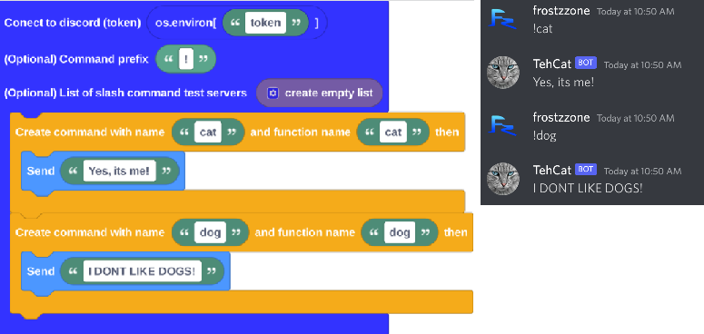

# [S4P](https://s4d-py.vercel.app/)

🐱 Make your code using Scratch blocks! [S4P](https://s4p.vercel.app/) is an fork of [S4D PY](https://s4d-py.vercel.app/). Thanks to [frostzzone](https://github.com/frostzzone) for their great work!

S4D PY is forked from [469](https://deploy-preview-469--scratch-for-discord.netlify.app) that is forked from [the original S4D](https://scratch-for-discord.netlify.app) made by [Androz2091](https://github.com/Androz2091)

## Features

* 🖥️ No code knowledge required!  
* ⏩ Make a code in less than 2 minutes!  

<!--## Example

<!--## Run On Repl.it

You can run your bot on repl.it. To do so, click the download link at the top right corner of the website. Import these files in your repl.it project, and run the following commands in the "SHELL" tab:
- `npm install`
- `node bot.js` (or hit the Run button)

And you're done!-->

## Installation

To run S4P, follow these steps:

* Clone the project. Run `git clone https://github.com/Parham1258/S4P`.
* Run `yarn install` to install project dependencies.
* Run `yarn start` to start the development server.
* Go to `http://localhost:3000`!

<!--## How to set up your bot

The discord.js guide has [instructions for setting up a bot application](https://discordjs.guide/preparations/setting-up-a-bot-application.html#creating-your-bot). Once you've followed the instructions you can paste the bot token into the "Connect to Discord with token..." block. The next page in the guide shows how to invite the bot to a server.

## Desktop Apps
**[Click Here](https://androz2091.github.io/scratch-for-discord/download/index.html)** to download desktop version of **scratch-for-discord**.

## Android App
**[Google Play Store](https://play.google.com/store/apps/details?id=com.snowflakestudio.scratchfordiscord)**
-->
### Preview

## Credits

* Snowflake107 ([snowflake107](https://github.com/Snowflake107))
* Blockly ([google/blockly](https://github.com/google/blockly))
* 7coil [7coil](https://github.com/7coil)
* S4D PY ([s4d-py/scratch-for-discord](https://github.com/s4d-py/scratch-for-discord))
